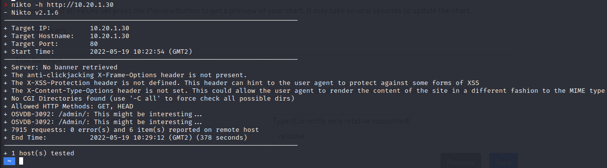
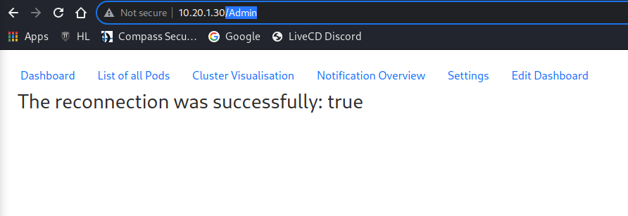
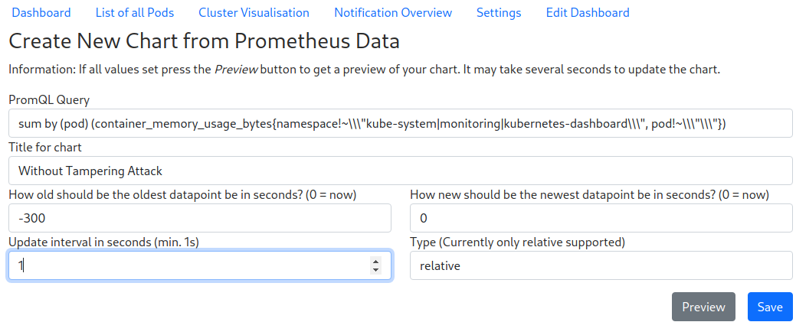
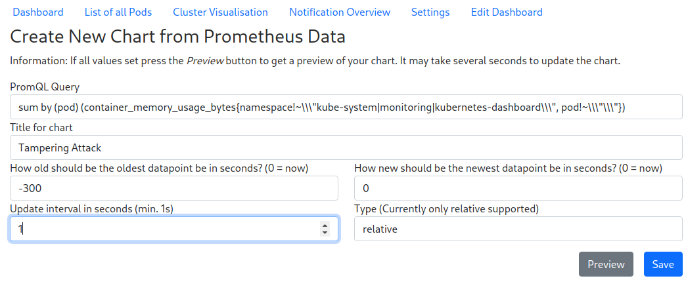
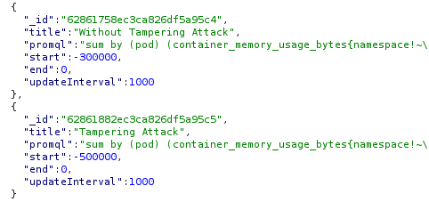

# Security Assessment 19.05.2022

To hold the security assessment up to date and test our application
regularly for potential threats we repeat the security assessment again.
This assessment is performed on the current project state of our
KubeWatch application.

## Methodology

To perform this assessment I combine the vulnerability assessment in
form of the threat model some chapters before and the penetration
testing with the attempt to exploit the most common vulnerabilities in
this assessment. This assessment is not that deapth because of the
knowledge and the actual project state which is not fully finished yet
and so this assessment is just a regularly check if all the common OWASP
Top 10 are mitigated. For more detail about the security test concept
you will find a detailed list in the test concept chapter.

To perform this assessment the following Tools are used: Browser, Nikto,
Burp Proxy

## Scope

This security assessment is security a test for our KubeWatch
application. The security will be tested on the production environment
which is located in the INS Cluster. The goal of the assessment is to
check the KubeWatch application for common vulnerabilities. This
assessment will only cover the most common vulnerabilities from the
threat model and is not a final security assessment.

## Report Summary

As of commit `395938f7` from 19 May 2022, we did not find any known
vulnerabilities in the KubeWatch application by testing only the OWASP
TOP 10 from the test concept which are relevant for our project. The
injection and SSRF attack was unsuccessful.

By testing the KubeWatch application with an additional tampering
attack, it will be successful. So Man-in-the-Middle (MITM) is already a
problem for our application but with the aspect that this application is
only needed for company internal monitoring, the attacker must be
already in the system to make a MITM attack successfully with the
assumption that the applicattion is only available from the internal
network.

The other analysis with Nikto returns some bad points. Our application
need some additional web headers to make it more secure. At the other
hand there are some vulnerabilities which can possible end up in an
insecure direct object reference (IDOR) attack. To prevent this attack
we need to check that only routes are available which are needed and
return an error if another URL is used.

## Detailed Report

### Nikto

#### Brief Description

The first step of this report is to analyse the KubeWatch web
application with a common vulnerability analyse tool which is calles
Nikto. This tool will check a few things like header options, IDOR
attack possibilities for common IDOR attacks.

#### Attack

For this attack i used the described Nikto tool and enter the following
command: `nikto -h http://10.20.1.30`

This will test the application by enter a host address.

#### Result

In the screenshot above there are some possible behaviour and header
options listed that should be changed to be secure and avoid unexpected
behaviour. The following header options should be set in the
application:

-   `anti-clickjacking X-Frame-Options`

-   `X-XSS-Protection`

-   `X-Content-Type-Options`

The `anti-clickjacking X-Frame-Options` header prevents a clickjacking
attack on server-side which is described in more detail here: [OWASP -
Clickjacking](https://owasp.org/www-community/attacks/Clickjacking).

The `X-XSS-Protection` header mitigate reflected Cross-Site Scripting
(XSS) attacks which is described in more detail here: [Mozilla -
X-XSS-Protection](https://developer.mozilla.org/en-US/docs/Web/HTTP/Headers/X-XSS-Protection).

The `X-Content-Type-Options` header to avoid MIME type sniffing and is
described in more detail here: [w3cub -
X-Content-Type-Options](https://docs.w3cub.com/http/headers/x-content-type-options).

Additionally, the routes `/admin` and `/Admin` should be deleted, because
both of them are not needed, and they might be exploited.

### Tampering attack

#### Brief Description

Tampering attacks allows an attacker to modify the packages between
client and server. With this attack a malicious user can exploit the
application for own benefits and Man-in-the-Middle (MITM) attack is also
one part of tampering.

#### Attack

For this attack I used the Burp Procy tool which allow me to intercept a
request and modify it. I tried the attack by adding a new chart to the
dashboard.

First I enter a valid PromQL query because I need a reference chart
which is valid and withour any tampering attack.

And then I entered another chart which I stop with the Burp Proxy tool.

In the next step I activate the intercept mode in the Burp Proxy tool to
catch the new chart request. There I changed the time period from
\"-300\" to \"-500\". After that I forward the tampered request and
check loading request and response for the dashboard again.

should be the same because I entered both time the same chart input. But
you will see the time period is changed now.

### Injection attack

#### Brief Description

Injection attacks can occur on two levels in the KubeWatch application:
on the KubeWatch Backend API and Prometheus. However, the second is not
relevant for this assessment since the only queries are hard-coded and
submitted by the backend only.

The KubeWatch Backend API is connected to a MongoDB database which is
NoSQL-based. NoSQL injection attacks are possible by using the JSON
structure to send queries to the database which are processed as valid
commands.

#### Attack

For our assessment, we tried to query the database so that it would
return the top-level entry. This can be done by sending the following
string via an input field that is supposed to query the database:
`'{$ne: null}'`.

There are currently only one field which take inputs and store them in
the MongoDB database. And that is on the */notifications* page, when you
enter a new notifiction.

#### Result

The attack was unsuccessful. This is because of three types of input
validation on two different layers.

Firstly, the input forms in the frontend are of type text and type
email. This achieves that any input to both fields is treated as text,
and additionally, type email requires the specific email format so that
no other sequence of characters is allowed.

Secondly, handlebars are used on the backend which have the benefit when
using two curly brackets to retrieve values from a variable, e.g.
`{{data}}`, any value is interpreted as a string. However, if three
curly brackets were used, the data input is treated as an object, which
would allow execution of e.g. HTML syntax.

Thirdly, since Typescript is used on the backend, the class which is
used to store user inputs contains two variables for each input field.
Both required the input to be of type string.

These three defence mechanisms thwart any type of injection attack.

### Server-Side Request Forgery

#### Brief description

SSRF can currently be attempted on the */notifications* page, which is
temporarily set up to allow the testing of notifications. This page
allows two user inputs: one to trigger a test notification, and the
second provides a reason to silence the notification.

The triggering of notifications will be disabled in the future, however,
the silencing input will remain to allow a user to close any
notifications. Since the silencing reason will be stored in the
database, there may be injection attacks or even SSRF attacks possible.

#### Attack

Similar to the injection attack, we tried to first trigger the pop-up of
an alert using a script: ``. Also, we tried
to call a common localhost address, e.g. `http://localhost:8080`.

#### Result

Both attempts were unsuccessful. This is again because of input
validation on the front- and backend as seen previously in the injection
attack.

The frontend input fields allow text only, and the rendering is again
performed by handlebars. Both elements are correctly implemented using
`type=text` and using double curly brackets for the handlebars.

Also, since Typescript is used, the class for handling notifications
requires the notification reason and the silencing text to be stored as
a string.

All three elements do prevent any successful attempt to either perform
an injection or SSRF attack.
